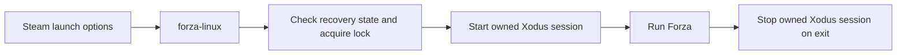

# How it works

[Home](Home.md) · [Advanced setup](Advanced-setup.md) · [Evidence and history](Evidence.md)

The integration gives Forza's Steam edition a dedicated compatibility tool and
an Xbox service for each game session. The bootstrap release packages the reviewed
open-source components; a separately supplied Microsoft threading runtime remains required.

## The components

| Component | Job |
| --- | --- |
| `GE-Proton11-3-FM` | Dedicated Proton layout with the reviewed controller and storage fixes |
| Legacy XGameRuntime bridge | Connect the game's runtime calls to the matching Xodus generation |
| Xodus service, CLI, and overlay | Xbox service integration and the explicit Invite/Join picker |
| Licensed Microsoft threading DLL | User-supplied runtime in the game's prefix, outside public artifacts |
| `forza-linux` | Own one game's Xodus service lifecycle and enforce recovery checks |
| `forza-doctor` | Check readiness without installing, patching, starting services, or signing in |

The installable runtime profile is `legacy-v0.1`, including in the v0.2.0 bootstrap.
A newer release of this installer does not mean it uses the rejected newer
WineGDK/Xodus protocol pair. See [runtime versions](Evidence.md#runtime-versions).

## One game session

The launcher creates a one-shot private ownership token. The user service must
consume that token before it starts, so a direct `systemctl start` is intentionally
rejected. The launcher waits for its socket and stops only the service invocation
it owns. A pre-existing service is preserved. Xodus is not enabled as a login daemon.

## Why exact versions matter

The runtime and Xodus must speak the same protocol. The known-build patcher also
accepts only the original and patched hashes in `manifests/supported-builds.toml`.
It checks all four controller/storage targets before writing and retains verified
backups outside the compatibility-tool directories. An unknown or mixed build is
a reason to stop, not to bypass the hash check.

The controller fallback repairs the reviewed physical XInput controller identity
path in `windows.gaming.input.dll`. The storage fallback implements the reviewed
`StorageDeviceTrimProperty` response in `mountmgr.sys` for AP702 HDD/SSD rejection.

## Why recovery records matter

Installers bind a plan to exact inputs and destinations, keep backups, and record
progress before publishing files. The launcher refuses unfinished recovery states.
There is no claim that changes across filesystems happen atomically; recovery
uses recorded hashes and stages to restore known state while retaining unexpected
files. Acceptance keeps backups, and uninstall removes only proven owned files.

Bash owns the launcher and shell workflows; Python owns bootstrap coordination,
secure file transactions, and patching. Contributor details and the original
transaction design are linked from [Evidence and history](Evidence.md).
